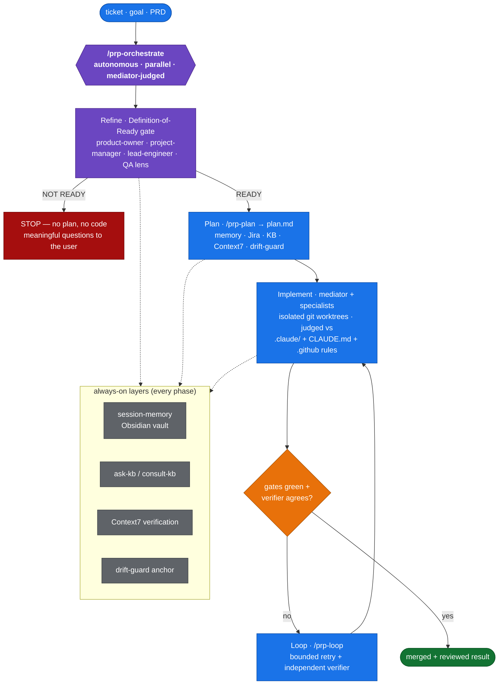
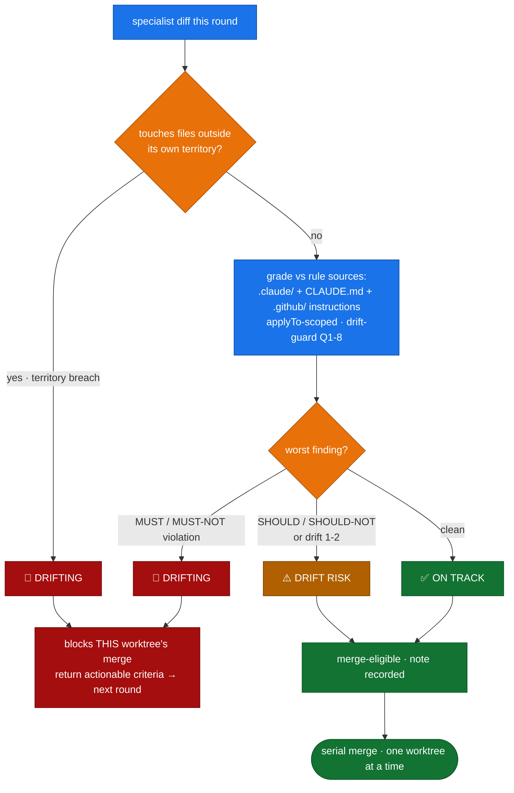

# arturgomes/claude-code-toolkit

Self-contained Claude Code plugin that brings intelligent planning and implementation to your codebase — with
persistent session memory in Obsidian vault, Context7 library verification, and drift-guard requirements anchoring.

> For [Claude Code CLI](https://docs.anthropic.com/en/docs/claude-code) only — not Claude Desktop.

---

## What This Does

Adds intelligent memory and verification layers to the PRP (Planning-Research-Process) workflow:

- **Persistent Memory**: Session notes stored in Obsidian vault, synced across devices
- **PRP Vault Integration**: All plans and reports in Obsidian with frontmatter and wikilinks
- **Context7 Library Verification**: Verify external library APIs before writing code
- **Drift Guard**: Seven-question validation at each phase to prevent scope creep
- **Knowledge Base Consultation**: Query personal KB for patterns and principles (optional)
- **Orchestration layer** (`/prp-orchestrate`): a refinement gate + full planning + a mediator-judged
  parallel agent team that fans work to specialists in isolated git worktrees

### The actions, and how they compose



`prp-plan`, `prp-implement`, and `prp-loop` also run **standalone** — `/prp-orchestrate` is the
autonomous umbrella that chains them behind a refinement gate and a mediator.

---

## Prerequisites

- [Claude Code](https://docs.anthropic.com/en/docs/claude-code) installed and authenticated
- Obsidian vault at `~/Documents/Obsidian-Vault/` (recommended for cross-device sync)
- A Jira account (optional — Jira MCP is optional)

---

## Installation

### Step 1 — Install the plugin

Open your terminal and run Claude Code. Plugin commands run **inside** the Claude Code session, not from your shell:

```
# Inside claude session:
/plugin marketplace add arturgomes/claude-code-toolkit
/plugin install codebase-intelligence

/reload-plugins
```

Verify:
```
/plugin list
```

You should see `codebase-intelligence` listed.

### Step 2 — Set up Obsidian vault structure

The plugin stores PRPs and session memory in your Obsidian vault. Create the required directories:

```bash
mkdir -p ~/Documents/Obsidian-Vault/02-Notes/Plans/completed
mkdir -p ~/Documents/Obsidian-Vault/02-Notes/Reports
mkdir -p ~/Documents/Obsidian-Vault/02-Notes/Sessions
```

The plugin will automatically:
- Create plans in `~/Documents/Obsidian-Vault/02-Notes/Plans/`
- Create reports in `~/Documents/Obsidian-Vault/02-Notes/Reports/`
- Archive completed plans to `~/Documents/Obsidian-Vault/02-Notes/Plans/completed/`
- Save session memory to `~/Documents/Obsidian-Vault/02-Notes/Sessions/`

All files include Obsidian frontmatter (YAML metadata) for searching and linking.

### Step 3 — Register MCP servers

Run these **from your shell** (outside Claude Code). They register globally — available in every project.

#### Context7 — verified library documentation

```bash
claude mcp add context7 \
  --scope user \
  --transport http \
  https://mcp.context7.com/mcp
```

#### Atlassian Jira (optional)

```bash
# 1. Get an API token: https://id.atlassian.com/manage-profile/security/api-tokens
# 2. Encode your credentials
echo -n "your-email@company.com:your-api-token" | base64

# 3. Register the MCP
claude mcp add atlassian \
  --scope user \
  --transport http \
  https://mcp.atlassian.com/v1/mcp \
  --header "Authorization: Basic <paste-base64-output-here>"
```

#### Verify

```bash
claude mcp list
# Should show: context7, atlassian (if configured)
```

### Step 4 — Set up your knowledge base (optional)

The `ask-kb` and `consult-kb` skills use a personal knowledge base of books
and principles you've indexed. Skip this step if you don't have one yet — the skills degrade
gracefully when no KB is present.

```bash
mkdir -p ~/kb

# Download the example registry to use as a template
curl -sL https://raw.githubusercontent.com/arturgomes/claude-code-toolkit/main/kb-registry-example.yaml \
  > ~/kb/kb-registry.yaml

# Edit it to point at your actual KB files
$EDITOR ~/kb/kb-registry.yaml
```

To add a book to your KB later, upload the PDF to Claude Code and say:
```
> Add this PDF to my knowledge base
```

---

## Usage

Run the whole pipeline autonomously with `/codebase-intelligence:prp-orchestrate`, or drive each stage
by hand with `/codebase-intelligence:prp-plan` → `prp-implement` → `prp-loop`.

### Orchestrate a ticket end-to-end (autonomous)

```
/codebase-intelligence:prp-orchestrate SEATHQ-9999 --preset seathq
```

Refines → plans → fans work to specialists in isolated worktrees → judges every diff against the
repo's rules → merges serially. It stops for a human **only** on a requirement fork or a red
blast-radius action. Each round, the mediator gates every specialist's diff like this:



### Plan a new feature

```
/codebase-intelligence:prp-plan "add PDF export for invoices PROJ-421"
```

What happens automatically:
1. Reads current git branch → extracts `PROJ-421`
2. Creates/loads session memory in `~/Documents/Obsidian-Vault/02-Notes/Sessions/PROJ-421/<branch>.md`
3. Fetches Jira ticket details + acceptance criteria (if Jira MCP configured)
4. Runs codebase exploration and analysis
5. Checks your KB for relevant patterns (if configured)
6. Verifies library APIs via Context7
7. Generates plan in `~/Documents/Obsidian-Vault/02-Notes/Plans/pdf-export-for-invoices.plan.md`
8. Saves session findings to memory with keyword indexing

The plan includes:
- Obsidian frontmatter with title, created date, project, tags
- Intelligence Context section with AC, KB findings, Context7 facts
- AC Traceability table mapping tasks to acceptance criteria
- Patterns to mirror from your codebase
- Step-by-step implementation tasks

### Implement the plan

```
/codebase-intelligence:prp-implement ~/Documents/Obsidian-Vault/02-Notes/Plans/pdf-export-for-invoices.plan.md
```

What happens automatically:
1. Restores session memory from prior planning session
2. Runs drift check before every task (validates against AC)
3. Verifies library APIs via Context7 before writing code
4. Saves memory every ~3 tasks with progress updates
5. Creates report in `~/Documents/Obsidian-Vault/02-Notes/Reports/`
6. Archives plan to `.../plans/completed/` when done

### Resume after QA failure (weeks later)

```
git checkout feature/PROJ-421-pdf-export
/codebase-intelligence:prp-plan "fix PROJ-421 QA failures"
```

Memory loads automatically from Obsidian vault — prior investigation, implementation decisions, and QA failure context restored without re-searching.

---

## Validation

After installation, verify that the marketplace and plugin are correctly set up:

### Step 1: Verify Marketplace Structure

Run these commands from your terminal (not in Claude Code):

```bash
# Validate JSON syntax
jq '.' .claude-plugin/marketplace.json
jq '.' plugins/codebase-intelligence/.claude-plugin/plugin.json

# Verify version consistency
echo "Marketplace version: $(jq -r '.metadata.version' .claude-plugin/marketplace.json)"
echo "Plugin version: $(jq -r '.version' plugins/codebase-intelligence/.claude-plugin/plugin.json)"
# Both should show: 2.0.0

# Verify component directories exist
test -d plugins/codebase-intelligence/commands && echo "✅ commands/"
test -d plugins/codebase-intelligence/skills && echo "✅ skills/"
test -d plugins/codebase-intelligence/agents && echo "✅ agents/"

# Count components
echo "Commands: $(ls -1 plugins/codebase-intelligence/commands/*.md 2>/dev/null | wc -l)"
echo "Skills: $(ls -1 plugins/codebase-intelligence/skills/*.md 2>/dev/null | wc -l)"
echo "Agents: $(ls -1 plugins/codebase-intelligence/agents/*.md 2>/dev/null | wc -l)"
# Expected: Commands: 2, Skills: 15, Agents: 4
```

**Expected output**:
- Both JSON files parse without errors
- Versions match (2.0.0)
- All three component directories exist
- Component counts match expected values

### Step 2: Verify Plugin Installation (in Claude Code)

Inside a Claude Code session:

```
/plugin list
```

**Expected output**:
- `codebase-intelligence@2.0.0` appears in the list

### Step 3: Verify Command Discovery

Inside a Claude Code session, start typing:

```
/codebase-intelligence:prp-
```

**Expected output**:
- Commands autocomplete
- Both `/codebase-intelligence:prp-plan` and `/codebase-intelligence:prp-implement` appear

### Step 4: Verify Skill Availability

Inside a Claude Code session:

```
Skill(session-memory)
```

**Expected output**:
- Skill loads without errors
- If vault directories don't exist, skill provides setup instructions

### Step 5: Test End-to-End Workflow

Inside a Claude Code session:

```
/codebase-intelligence:prp-plan "test feature"
```

**Expected output**:
- Command executes
- Creates plan file in `~/Documents/Obsidian-Vault/02-Notes/Plans/`
- Plan includes Intelligence Context section with AC
- Plan includes AC Traceability table

### Troubleshooting Validation Failures

**Marketplace cannot be added**:
- Verify `marketplace.json` is valid JSON: `jq '.' .claude-plugin/marketplace.json`
- Check that `plugins[0].source` path exists: `ls -d ./plugins/codebase-intelligence`

**Plugin install fails**:
- Verify `plugin.json` is valid JSON: `jq '.' plugins/codebase-intelligence/.claude-plugin/plugin.json`
- Check version field exists: `jq '.version' plugins/codebase-intelligence/.claude-plugin/plugin.json`
- Ensure `.claude-plugin/` contains only `plugin.json` (no component directories)

**Commands not discoverable**:
- Verify files exist: `ls plugins/codebase-intelligence/commands/*.md`
- Check frontmatter in command files: `head -20 plugins/codebase-intelligence/commands/prp-plan.md`
- Ensure `name:` field follows format: `codebase-intelligence:<command-name>`

**Skills fail to load**:
- Verify skill files exist: `ls plugins/codebase-intelligence/skills/*.md`
- Check file naming convention (kebab-case): skill file `session-memory.md` → invoked as `Skill(session-memory)`
- Ensure skills are at plugin root level: `plugins/codebase-intelligence/skills/` not `.claude-plugin/skills/`

**Agents not invokable**:
- Verify agent files exist: `ls plugins/codebase-intelligence/agents/*.md`
- Check that agents are referenced in command files: `grep -i "agent" plugins/codebase-intelligence/commands/prp-plan.md`

**Version mismatch warnings**:
- Sync versions: marketplace `metadata.version` must match plugin `version`
- Update either file to match: `jq '.metadata.version = "2.0.0"' .claude-plugin/marketplace.json`

---

## What's Included

### Commands

| Command | Description |
|---|---|
| `prp-orchestrate` | Autonomous umbrella: refinement (Definition-of-Ready) gate → full `prp-plan` → mediator-judged parallel agent team (specialists in isolated git worktrees, per-round rules verdict, serial merge). Input a goal, `JIRA-TICKET`, or PRD; stops for a human only on a requirement fork or red blast-radius |
| `prp-plan` | Generate a battle-tested implementation plan — with vault storage, session memory, Jira injection, drift-guard anchor, KB consultation, Context7 verification, and AC traceability table |
| `prp-implement` | Execute a plan end-to-end — with memory restore, per-task drift checks, Context7 before library calls, vault-based reports, and session memory saves |
| `prp-loop` | Bounded closed-loop runner — re-attempts a goal until an executable gate passes AND an independent fresh-context verifier agrees, or a hard stop fires |
| `doctor` | Read-only preflight — checks system tools, MCP servers, the KB engine, and vendored tools; prints the exact fix for anything missing |

### Agents

The `/prp-orchestrate` team. Each agent has a **recipient-adaptive language mode** — it matches its register to who it addresses (plain **Stakeholder** language to `product-owner` / `project-manager` / **Jira** / **Slack**; technical **Engineering** language to dev peers / **GitHub**), so a project-manager never gets dev jargon. Each row links to that agent's own README describing its full capabilities.

| Agent | Role | Register default | Capabilities (README) |
|---|---|---|---|
| `product-owner` | Refinement — business-value lens | Stakeholder | [product-owner.README.md](plugins/codebase-intelligence/agents/product-owner.README.md) |
| `lead-engineer` | Refinement — technical-feasibility lens | Stakeholder (on panel) | [lead-engineer.README.md](plugins/codebase-intelligence/agents/lead-engineer.README.md) |
| `project-manager` | Planner — contract + disjoint territory map | Stakeholder | [project-manager.README.md](plugins/codebase-intelligence/agents/project-manager.README.md) |
| `core-db-specialist` | Generator — shared types / DB / migrations | Engineering | [core-db-specialist.README.md](plugins/codebase-intelligence/agents/core-db-specialist.README.md) |
| `backend-specialist` | Generator — APIs / services / handlers | Engineering | [backend-specialist.README.md](plugins/codebase-intelligence/agents/backend-specialist.README.md) |
| `frontend-specialist` | Generator — UI / components / pages | Engineering | [frontend-specialist.README.md](plugins/codebase-intelligence/agents/frontend-specialist.README.md) |
| `qa-analyst` | Evaluator — behavioral gates (exit 0/non-0) | Engineering | [qa-analyst.README.md](plugins/codebase-intelligence/agents/qa-analyst.README.md) |
| `pr-reviewer` | Evaluator — adversarial fresh-context review | Engineering | [pr-reviewer.README.md](plugins/codebase-intelligence/agents/pr-reviewer.README.md) |
| `ux-specialist` | Evaluator/advisor — design-taste check | Engineering/craft | [ux-specialist.README.md](plugins/codebase-intelligence/agents/ux-specialist.README.md) |

### Skills

| Skill | Purpose |
|---|---|
| `session-memory` | Cross-session memory in Obsidian vault at `~/Documents/Obsidian-Vault/02-Notes/Sessions/` |
| `drift-guard` | Seven drift questions at every phase gate — keeps work anchored to AC |
| `context7-research` | Verified library docs via Context7 MCP — no hallucinated API calls |
| `ask-kb` | Query personal KB for patterns and principles |
| `consult-kb` | Review architecture decisions against KB |
| `kb-indexer` | Ingest books/PDFs into the KB |
| `skillify` | Extract a reusable SKILL.md draft from a completed plan + report pair (writes to `~/skill-drafts/`, never directly into the plugin) |
| `doubt-driven` | Mid-flight adversarial review with a fresh-context sub-agent that falsifies load-bearing claims via grep; hooked into `prp-implement` Step 3.7b (one-shot at task ⌈N/2⌉) |
| `claude-md-init` | Scaffold a 12-rule CLAUDE.md (Karpathy 1–4 + Mnilax 5–12) with anti-rationalization table and tool-routing tail; refuses to overwrite an existing ≥50-line CLAUDE.md without `--append` |
| `ship` | Scan → commit → push → parallel review fan-out (function/test/security) → PR; skip rule for tiny PRs (≤2 files, <50 LOC, no `auth\|payment\|migration\|secret\|token\|crypto` path) |
| `token-audit` | 9-pattern token-economy audit (CLAUDE.md bloat, history re-reads, hook injection, cache-miss sleeps, skill auto-load FPs, MCP idle cost, extended-thinking default, wrong-direction generation, plugin churn) → structured report in `02-Notes/Reports/` |

### Tools

| Tool | Purpose |
|---|---|
| `migrate-prp-to-vault.sh` | One-time migration from `.claude/PRPs/` to Obsidian vault |
| `session_indexer.py` | Extract keywords from session memory for fast lookup |

---

## Obsidian Integration

All PRP files are stored in your Obsidian vault with frontmatter:

```yaml
---
title: feature-name
created: 2026-04-13
source: Planning session
project: your-project
tags:
  - prp
  - plan
  - feature-name
---
```

This enables:
- **Full-text search** across all plans and reports
- **Wikilinks** between related plans, sessions, and reports
- **Cross-device sync** via Obsidian Sync or cloud storage
- **Tag filtering** to find related work
- **Graph view** to visualize relationships

Example wikilinks:
- `[[feature-name]]` — Link to plan
- `[[PROJ-421]]` — Link to session notes
- In reports: `plan: "[[feature-name]]"` — Bidirectional linking

---

## Migration from .claude/PRPs

If you have existing PRP files in `.claude/PRPs/`, migrate them to the vault:

```bash
./tools/migrate-prp-to-vault.sh --execute
```

This will:
1. Copy all plans and reports to Obsidian vault
2. Add frontmatter to all files
3. Update README index with wikilinks
4. Preserve all original content

A backup is created at `~/prp-backup-$(date +%Y%m%d).tar.gz` before migration.

---

## Troubleshooting

**Plugin load errors (`/doctor`)**
Run `/plugin update codebase-intelligence` then `/reload-plugins`.

**Memory not creating**
Ensure the vault directory exists: `ls -la ~/Documents/Obsidian-Vault/02-Notes/Sessions/`. Create it if missing.

**Plans not appearing in Obsidian**
1. Check that Obsidian is watching the vault directory
2. Refresh the vault in Obsidian (Cmd+R on macOS)
3. Verify frontmatter syntax is valid YAML

**Context7 verification failing**
Check MCP connection: `claude mcp list` should show `context7`. Re-register if missing.

**KB skills not working**
Check `~/kb/kb-registry.yaml` exists and has valid YAML syntax. The skills degrade gracefully if KB is unavailable.

---

## Directory Structure

```
~/Documents/Obsidian-Vault/
└── 02-Notes/
    ├── Sessions/                    # Session memory
    │   └── TICKET-123-branch.md
    ├── Plans/
    │   ├── feature-a.plan.md        # Active plans
    │   ├── feature-b.plan.md
    │   └── completed/               # Archived plans
    │       └── feature-c.plan.md
    └── Reports/
        ├── feature-a-report.md      # Implementation reports
        └── feature-c-report.md
```

All files include frontmatter and are fully searchable in Obsidian.

---

## License

MIT
