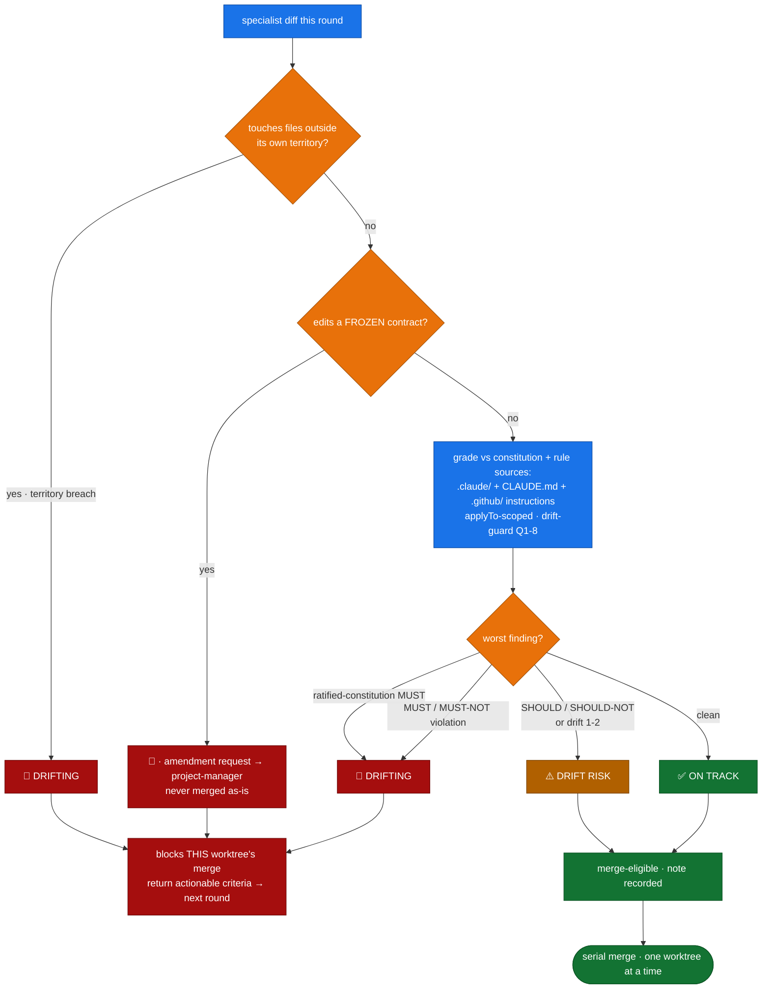

# codebase-intelligence

A **standalone** PRP engineering toolkit. Ships its own `prp-plan`, `prp-implement`,
and `prp-loop` commands plus their agents, layered with memory, KB, Context7,
drift-guard, and a bounded self-verifying loop. Codebase search is **Serena LSP
structural search** (single tier). Cross-session memory lives in an Obsidian vault via
the `ultimate-obsidian` MCP. **No prp-core (or any other plugin) required.**

**Version history**
- **v3.20.0** — **one copy of every shared rule, and two more leaks closed.** An audit of every durable write target found that the `orchestration-state.json` fix in v3.19.0 had two siblings left behind, and that the rules governing those writes were restated in up to fifteen files each. (1) **New `shared/` directory — the single copy of every cross-cutting contract.** `model-tier.md` (the `CI_MODEL_TIER` semantics that were duplicated verbatim across **15** files, plus the Model Routing definition that had been living inside `prp-plan.md` while eleven other files referenced it), `vault-persistence.md` (the artifact→path registry, the write protocol, the no-local-mirror rule, write-scope, and the omit-dangling-key rule — previously Step 4.5 of `prp-orchestrate` and nowhere else, which is why every skill written since re-decided persistence from scratch and the terminal-print answer kept winning), `git-base-detection.md`, `branch-rule.md`, `comms-register.md`, `secret-scrub.md`, and `gate-command-resolution.md`. Each file cites what it needs in one line and keeps only what is genuinely its own — a skill's *own* invariant list, an agent's *own* recipient routing. **The `shared/` rule is three:** a block belongs there once it appears in three or more files; two is a coincidence, three is a contract with no owner. (2) **The `pre-pr-gate` receipt moves into the vault.** `<repo>/.claude/pre-pr-gate.json` is gone; the receipt is now an entry of `receipts[]` inside `02-Notes/Sessions/<TICKET>-<slug>.state.md`, one per repo per stack layer, SHA-bound. The receipt's entire job is to be read by someone who is not its author — the sibling worktree merging beside you, the stack layer above you, `pr-reviewer` in a fresh context — and a file in one worktree's `.claude/` is invisible to all of them and dies with the checkout. **A failed vault write is a 🔴 that stops the phase; there is no local fallback.** (3) **The `/prp-checkup` ledger moves into the vault** — `02-Notes/Sessions/prp-checkup-<repo>.md` instead of `<repo>/.claude/prp-checkup.json`. It is the idempotency key for *destructive* actions, and the old doc conceded the bug in its own text ("do not let two machines silently disagree about what has been cleaned"); a vault note is machine-independent by construction. (4) **Ten skills that produced findings and persisted nothing now have a named vault target** — `spec-analyze` (whose CRITICAL verdict vetoes fan-out and previously existed only in scrollback), `spec-converge` (the `unrequested`-code evidence a human has to rule on), `prp-pr-review` (*why* a bot suggestion was rejected — the single most re-litigated argument in a review cycle), `quality-review`, `function-quality`, `test-quality`, `test-scenarios`, `technical-plan`, `constitution` (a vault mirror; the repo copy stays authoritative and ships in the PR), and `benchmark-kb` (retrieval quality only means something as a series, and `/tmp` is not a series). (5) **Two latent bugs surfaced by the sweep, both fixed:** the base-branch detection had **three divergent copies** — some fell straight back to `main` while others tried `git remote show origin` first, so a `develop`-default repo got a different answer depending on which skill asked, and the one that guessed `main` then diffed the wrong range; and `session-memory`'s declared write-scope (`Sessions|Plans|Reports`) did not include `02-Notes/pr-descriptions/`, a path a shipped skill already writes to. (6) **New `validate.sh` check C8** keeps it from coming back: every `shared/` citation must resolve, every `shared/` file must be cited by something, and a shared block re-inlined into three or more files is reported as a regression rather than discovered a year later. No runtime behaviour of any command changed beyond the three write targets above.
- **v3.19.0** — **the vault is the system of record, and every PR is described the same way.** Two leaks are closed. (1) **Orchestration state moves into the vault.** `<repo>/.claude/orchestration-state.json` is gone; the same JSON contract now lives as a single fenced `json` block inside `02-Notes/Sessions/<TICKET>-<slug>.state.md`, written through the `ultimate-obsidian` MCP by the mediator alone, beside the run's session note. A repo-local state file was invisible to the sibling worktrees that had to read it, invisible to the next session, and died with the checkout — the vault copy is none of those. Writes are always a whole-note **overwrite** of one full instance (an appended JSON document is an unparseable state file), the note carries typed knowledge-graph frontmatter (`type: session`, `related` → the session note), and **a failed vault write is a 🔴 that stops the phase — there is no local fallback**, because writing the file "just to keep going" recreates exactly what this replaced. The trade is deliberate and stated: state now requires the MCP to be reachable, and an unreachable vault fails loudly instead of drifting silently. (2) **New `pr-description` skill — the default for every PR the toolkit opens.** `ship` Step 4, `worktree-lifecycle` EXIT, `prp-implement` Phase 7, and `prp-orchestrate` (new **Step 4.6**, and once *per layer* under stacking) all call it unconditionally; **the "should I use pr-description?" question is gone**. Title format is mandatory — `[TICKET] task description title`, with the **repo root folder name** as the tag when no ticket exists anywhere (never `GENERAL`, never a guess). The description is **a vault artifact first and a PR body second**: it is written to `02-Notes/pr-descriptions/` (the ontology's home for the `pr-description` node type) *before* `gh pr create` runs, so a description survives a run that never opens the PR, and a failed vault write blocks the PR. The skill is portable — it resolves the repo with `git rev-parse`, never a hardcoded path — carries the `pre-pr-gate` receipt and review fan-out verbatim, and keeps the honesty rules (only tick what you verified; capture exit codes *inside* the redirect; count parity against the base in a repo that is already red). It never pushes and never opens the PR: that stays with the caller, and **the one surviving confirmation is `gh pr create` itself**, because it is outward-facing. `prp-orchestrate` **Step 4.5** now names the state note and the PR description as mandatory vault writes and forbids a local mirror of either.
- **v3.18.0** — **the checks live in the repo now, and setup follows the plugin to every machine.** Until this release the plugin's correctness was whatever its author happened to type into a shell, on one laptop, that day. Three pieces fix that. (1) **`scripts/validate.sh`** — the structural contract, committed: shell syntax (`bash -n`) · every JSON parses · frontmatter present and coherent on every command/skill/agent (a skill's `name:` **must** equal its directory, a command's `name:` must equal its filename — a disagreement silently registers the thing under the wrong name) · balanced code fences · **version consistency across `plugin.json` ↔ `marketplace.json` ↔ the README's newest entry** · and **no dangling `Skill(...)` or `/prp-*` reference**. It then defers to `claude plugin validate` for the harness's own schema rather than reimplementing it. `--strict` makes warnings fatal. Its first run found five real pre-existing defects — a `marketplace.json` three versions stale, a `/prp-pr` command that does not exist, and two commands missing frontmatter fields — all fixed here. (2) **`.github/workflows/validate.yml`** — the same script on a machine the author does not control, on every push and PR. CI grows **no** rules of its own; a second copy of a rule is a second place for it to be wrong. It also asserts the two properties that would otherwise break silently on other people's machines: `setup.sh` is safe with no tooling installed, and the SessionStart hook never fails a session and is a **silent no-op** on re-run. (3) **`scripts/setup.sh` + a `SessionStart` hook** — setup that travels with the plugin. `${CLAUDE_PLUGIN_DATA}` outlives plugin updates while `${CLAUDE_PLUGIN_ROOT}` does not, so a version stamp there detects "this machine has not set up *this* version yet" and runs setup exactly once per version. **Check-only by default**: it reports what is missing and the exact fix, and prints *nothing* when everything required is present — hook stdout is model context, and a chatty hook is a tax paid on every session forever. `--install` is the opt-in that actually installs (gh-stack, uv, the bookrag engine); this plugin is installed from a marketplace onto other people's machines, and silently installing software there is the same class of surprise `worktree-lifecycle` already refuses. Nothing about the runtime behaviour of any command or skill changed in this release.
- **v3.17.0** — **the end of the lifecycle**: every command in this plugin stopped at "PR opened", so once the PR merged its branch, its remote copy, its worktree, and a session note ending in *"resume here"* survived forever — one set per ticket. New **`post-merge-cleanup` skill** is the finish checklist, and it runs only **after** the merge: remove the worktree, delete the branch locally and on the remote, and close the session note. **GitHub is the merge authority** — a squash or rebase merge leaves the branch looking unmerged to git, so `git branch --merged` never decides a deletion. Four predicates gate every destructive step: **P1** the local tip must equal the merged PR's `headRefOid` (extra local commits were never in the PR — reported, never force-deleted), **P2** the worktree must be clean (no `--force`), **P3** no open PR may still target the branch (the stacked-PR guard — a merged bottom layer is not deleted under an unmerged layer above it), **P4** never a base or protected branch. New **`/prp-checkup` command** sweeps the merged PRs *you* authored since the last run, keyed by a `.claude/prp-checkup.json` ledger so each PR is finished exactly once; first run defaults to a 30-day window rather than all history, the plan is printed before anything happens, one confirmation covers the batch's remote deletions, `--dry-run` never asks, and a run that fails to reach GitHub does **not** advance the window. Closed-**unmerged** PRs are reported, never batch-deleted — that work exists nowhere else. `session-memory` gains **SESSION CLOSE** (v2.3.0): the one-time conclusion block (outcome, PR URL, merge commit, cleanup performed) plus a **`Carried forward`** line — closing a note with unresolved Open Failures and nothing carried forward is a protocol violation, not a tidy note — then `phase: closed` and the index line flipped to `done`. `prp-implement` gains **Phase 8** and `prp-orchestrate` **Phase 7**, both of which check the PR's real state and, on the normal case of a still-open PR, **clean nothing** and defer to `/prp-checkup`. `worktree-lifecycle` is unchanged in behaviour and now states its boundary explicitly: it owns the pre-merge half, never branch deletion or session closure.
- **v3.16.0** — **stacked pull requests**: `/prp-orchestrate` can now ship its slices as a GitHub stacked-PR chain — one PR per slice instead of one PR for the whole run. A slice was already what GitHub defines a stack layer as (merged, gated, independently testable, in priority order), so this is a shipping-shape choice, not a new decomposition. **Opt-in**: `--stack` forces it, `--no-stack` suppresses it, and otherwise it is **offered once** after decomposition when the run produced ≥2 slices and `gh stack` is available — *no answer, non-interactive, or ambiguity resolves to the existing single PR*, so nothing blocks. New **Phase A3** decides it once and records `stack` in `orchestration-state.json`; **Phase E** gives each slice a named, pushed branch (`stack/<slug>/sN-…`) whose base is the layer below it instead of successive shas on one integration branch; **Phase E4** adopts those branches with `gh stack init` / `push` / `submit` and then *verifies the on-GitHub topology* with `gh stack view --json` before declaring success. **`pre-pr-gate` becomes per layer** — GitHub enforces required checks, required reviews, and CODEOWNERS against the trunk for *every* PR in a stack, so a receipt bound to the top of the stack proves nothing about what is under it; a receipt whose SHA isn't that layer's tip counts as absent, and a missing receipt on any layer blocks the whole stack. Constraints are enforced, not assumed: **linear only** (a non-chain slice dependency falls back to a single PR rather than being flattened), **one stack per repo** (a `fe`+`be`+`core` run makes three), never force-push a layer another is stacked on (restacking is `gh stack rebase`/`sync`), and **never auto-merge** — merging is bottom-up, human-initiated, and `gh pr merge` cannot do it. `/doctor` now reports `gh` and the `gh-stack` extension as optional; absent ⇒ single-PR mode, stated once, never prompted. Per-layer CI cost is reported (`github.event.pull_request.stack` can dedupe jobs) but **never applied** — this flow still does not edit the target repo's workflows. `ship`, `worktree-lifecycle`, and every non-stacked path are unchanged.
- **v3.15.0** — **spec-driven orchestration**: closes the gaps between `/prp-orchestrate` and GitHub's spec-kit methodology, shifting failure detection left of the first worktree. (1) **Vertical slices replace layer-only lanes** — refinement now emits *prioritized user stories, each with an Independent Test*, and the mediator builds a small blocking **Foundational** slice then **one slice per story**, each ending in a merged, gated, **demoable checkpoint**. A run stopped at any checkpoint leaves a working feature instead of three-fifths of one. (2) New **`spec-analyze` skill** (Phase 0.5) — a read-only, fresh-context gate over the whole artifact chain (spec → plan → tasks → territory → contracts → constitution): coverage matrix, requirements with zero tasks, **tasks mapped to no requirement (scope creep caught before it is written)**, ambiguity, terminology drift, **a file claimed by two lanes**, an idle lane, a missing contract. CRITICAL ⇒ **no fan-out**; findings route to the phase that owns them, max 3 cycles. (3) New **contract freeze (Phase 1.5)** — every cross-boundary interface is published on the base branch with **failing** contract tests *before any worktree forks*, and is immutable to lanes (an edit is 🔴 routed to `project-manager`). This removes the cause of the integration breakage Phase 5.5 was built to catch. (4) New **`constitution` skill** — versioned architectural non-negotiables plus the three Phase -1 gates (Simplicity / Anti-Abstraction / Integration-First) and a **Complexity Tracking** table where every carried violation needs a *"simpler alternative rejected because"*; `draft` advises, `ratified` blocks, absent is a silent no-op. Read by refinement, `prp-plan`, `spec-analyze`, every round verdict, and the new **pre-pr-gate L9**. (5) New **`spec-converge` skill** (Phase 5.75) — append-only reconciliation of the gated branch against the spec, classifying gaps `missing | partial | contradicts | **unrequested**`; converged means `tasks.md` byte-for-byte unchanged; unrequested code is surfaced with evidence, never deleted. (6) **Bounded clarify loop** replaces the question dump: max **5** questions per session, one at a time, each answerable by picking from 2-4 options with a **stated recommendation** (via `AskUserQuestion`), every answer written straight back into the spec under a dated `## Clarifications` session, plus a generated **requirements checklist** ("unit tests for English") re-scored after each answer. (7) **Measurable `SC-###` success criteria** — technology-agnostic, tagged `buildable` or `outcome`, so "done" can no longer collapse into "the gates went green". (8) **Territory is now derived, not asserted** — plan tasks carry `story:` / `parallel:` / `files:`, and a lane's territory is the union of its tasks' files, which is what lets `spec-analyze` *prove* disjointness. (9) **`prp-implement` inherits both gates** — **Step 1.5** runs `spec-analyze` before the first task (CRITICAL ⇒ Phase 3 does not start) and **Step 4.7b** runs `spec-converge` on the gated HEAD before the report, so the same coverage and reconciliation guarantees hold whether you orchestrate or implement a plan by hand. (10) **Dual-write artifacts** — `specs/<slug>/{spec,plan,tasks}.md` + `contracts/` + `checklists/` land in the repo so intent ships in the PR next to the code, while the vault copy stays BM25-searchable (`spec_artifacts: both | repo | vault`).
- **v3.14.0** — adds the **`pre-pr-gate` skill**: a mandatory mechanical + bot-parity gate on the **integrated** branch before any PR exists. `/prp-orchestrate` gains **Phase 5.5** (run on the merged HEAD of every repo with diffs, after serial merge, before shutdown), `prp-implement` gains **Step 4.7**, and `ship` gains **Step 3a** (not subject to its tiny-PR skip rule) — so every route to a PR passes through it. Layers: **L0** resolve *real* gate commands (a prescribed script the repo lacks is a misconfiguration, never a silent pass; no mutating or watch-mode command may be a gate) → **L1** CI-parity install → **L2** whole-repo typecheck → **L3** changed-files lint at zero warnings → **L4** build → **L5** full non-watch suite → **L6** dangling/unresolved/**unused**-import sweep (blocking even where the repo's lint only warns and its CI never runs ESLint — the hole that let broken imports reach reviewers) → **L7** `applyTo`-scoped replay of the repo's own `.github` rulebook citing its real rule IDs (`FR-1`, `FQ-4`, `T-5`, `DB-3`, `PKG-1`, `CORE-002`, `SOLID-*`, `CG-*`) so GitHub Copilot review and Cursor bugbot have nothing left to report → **L8** hygiene sweep. Emits a SHA-bound **gate receipt** pasted into the PR body; 🔴 ⇒ no PR (blockers route back to the owning territory, max 3 re-gate cycles). Also **fixes `presets/seathq.yaml`**, whose `npm run type-check` existed in none of the four repos: per-repo `pre_pr_gate` + `rulebook` blocks, all commands verified against each `package.json` and `.github/workflows/ci.yaml`. `pr-reviewer` now reads the receipt instead of re-running its layers (a missing/stale receipt is its first blocking finding); `qa-analyst` and the three generator specialists must verify a command exists before trusting it.
- **v3.13.1** — refinement fix: Jira/Slack clarifying questions are now a single tweet-length line ("we could ABC because of XYZ" / "the AC says ABC but if we did that we'd lose/expose XYZ") instead of a multi-line structured breakdown; the ambiguity/blocks/options/impact analysis stays internal-only reasoning. Absence of matching code in `main` is no longer treated as ambiguity to interrogate — only an actual conflict with current production behavior triggers a question.
- **v3.13.0** — replaces the bookrag/Chroma dense index with a **local FTS5 (BM25) index over the Obsidian vault**, served by the `ultimate-obsidian` MCP (`search_kb` / `reindex_kb`). No embedding model, no vector store — the index is a disposable, machine-local, deterministic function of the markdown, kept fresh by MCP self-index-on-write plus a SessionStart catch-up (`kb-cli`). `ask-kb` / `consult-kb` / `benchmark-kb` now do their semantic work in the query (term expansion) instead of in embedding space. Env: `OBSIDIAN_VAULT_PATH`, `CI_KB_INDEX`, `CI_KB_EXCLUDE`.
- **v3.12.0** — adds the **Orchestration layer**: a `/prp-orchestrate <goal | JIRA-TICKET | prd.md>` command plus the `refinement` and `mediator` skills and **9 generic role agents** (`product-owner`, `lead-engineer`, `project-manager`, `frontend-specialist`, `backend-specialist`, `core-db-specialist`, `qa-analyst`, `ux-specialist`, `pr-reviewer`) bound to repos/stacks via swappable `presets/*.yaml`. Flow: **Phase R refinement** (a grooming panel drives a Definition-of-Ready gate — refined ACs + scenarios + DoD-from-ACs, zero open assumptions; NOT READY ⇒ STOP + clarifying questions for the user) → **Phase 0 plan** (the unchanged `/prp-plan`: session-memory + Jira + codebase agents + ask-kb + Context7-before-web + drift-guard → durable `plan.md`) → **mediator** fans work to 2-5 specialists each in their own git worktree (no two ever touch the same code — disjoint territory map), judges every diff each round against the target repo's `.claude/` MUST/SHOULD/MUST-NOT/SHOULD-NOT rules and blocks merges on 🔴, and merges passing worktrees serially. Autonomous — stops for a human only on a requirement fork or a red blast-radius action. `prp-plan` / `prp-implement` / `prp-loop` and their 4 agents are **unchanged** and remain callable building blocks. Grounded in the `claude-code`, `claude-certification`, and `llm-engineering` KB domains.
- **v3.11.0** — adds the `worktree-lifecycle` skill: every implementation runs in a fresh git worktree off the detected base branch (ENTER), torn down on user satisfaction (EXIT: save-before-delete, confirm-before-remove). Wired into `prp-implement` (Phase 2 + Phase 7) and referenced by `prp-loop` (L.3); capability-gated with an in-place serial fallback.
- **v3.10.0** — adds `/doctor`: a read-only preflight that checks system tools (`git`/`uv`/`python3`), MCP servers (`ultimate-obsidian` required; `serena`/`context7`/Atlassian optional), the bookrag engine, and vendored tools — printing the exact fix for anything missing.
- **v3.9.0** — vendors the web-cache tool (`web-search-hook`): the web-only subset of memory-central (owner's own code) now lives in `vendor/memory-central-web/`, run via `uv` with ephemeral deps. No `~/Documents/ai-tools/memory-central` checkout required; cache index stays at `~/.claude/memory/WEB-CACHE-001/`.
- **v3.8.0** — removes the `~/Documents/ai-tools/skills-mono-repo` dependency: the `bookrag` KB engine is now **bootstrapped on first use** (`/setup-kb`) — the public upstream is cloned at a **pinned commit** and the owner's own deltas (obsidian-ingest + a Chroma batching fix) are applied as local patches. No third-party code is vendored; KB skills resolve the engine at runtime via `scripts/bookrag-home.sh`.
- **v3.7.0** — decoupled from prp-core: the plugin is now fully self-contained (its own prp-plan / prp-implement / prp-loop commands and agents; no `prp-core:` invocations). Adds the `ingest-web-doc-to-kb` skill (autonomous web→KB ingestion, no API key).
- **v3.3.0** — adds `prp-loop`: a bounded closed-loop runner with contract-mandated stop rules and an independent verifier.
- **v3.4.0** — makes the loop self-improving: an optional context-isolating subagent per attempt, promotion of recurring/gamed failures to durable `## Loop Constraints`, and a verifier whose scrutiny rises with attempt count.
- **v3.5.0** — folds in 27 model-agnostic techniques mined from the `x-intel-2026-07` KB (52 sources) so every skill works **without any single model** (e.g. Fable-5). Every model-tier / effort / routing / worktree feature is capability-gated with a documented single-tier no-op fallback. Also **removes SocratiCode** (search is now Serena-only) and the superseded Python memory tools (memory is now pure `ultimate-obsidian` MCP).

`CI_MODEL_TIER` (`frontier | standard | light`, default `standard`) trades instruction
verbosity for capability while keeping all invariants mandatory at every tier — see
[Model-agnostic design](#model-agnostic-design-v350).

---

## Phase injection map — prp-plan

```
Pre-Phase I    → session-memory: load 02-Notes/Sessions/<TICKET>-<SUFFIX>.md via Obsidian MCP
Pre-Phase II   → Atlassian MCP: Jira ticket, AC, QA failure comments
Pre-Phase III  → drift-guard: TASK ANCHOR with verbatim AC (GATE if AC missing)

Phase 0 gate   → [ANCHOR] re-stated
Phase 1 gate   → drift-guard: user story maps to ≥1 AC?
Phase 1.5      → UNKNOWNS: enumerate every open question the AC leaves; route each to
                 Context7 / ask-kb / STOP+ask; log unresolved ones as explicit assumptions

Phase 2:
  Step 2A      → session-memory: cache pre-fill
  Step 2B      → codebase-explorer (Serena LSP + memory + KB) + codebase-analyst (Serena LSP)
  Step 2C      → codebase-search: Serena enrichment (fills gaps the agents missed)
  Step 2D      → ask-kb: personal KB patterns for feature domain
  Step 2E      → 2E-i collect evidence (file:line only) → 2E-ii interpret + drift verdict
  Gate         → drift-guard Q#1,2,5: every file must trace to ≥1 AC

Phase 3:
  Step 3A      → context7-research: verify all library APIs first
  Step 3B      → ask-kb: check KB before sending to web-researcher
  Step 3C      → web-researcher (KB pre-check + Context7 + web for gaps)
  Gate         → drift-guard Q#5: no research-introduced scope in plan

Phase 4 gate   → drift-guard Q#3: after-state = minimum that satisfies AC

Phase 5:
  KB review    → consult-kb: architecture against KB principles (🔴/🟡/🟢/💡)
  Gate         → drift-guard: full checks → ✅ ON TRACK required

Phase 6 plan:
  Added        → Intelligence Context (ticket, AC verbatim, KB, Context7, QA, assumptions)
  Added        → AC Traceability table (every AC → ≥1 task, every task → ≥1 AC)
  Added        → Model Routing block + per-task "Why (AC + intent)" line
  Facts-only   → unverified APIs written "UNVERIFIED — confirm at implement time", never invented
  Gate         → drift-guard Q#7: every AC has a task? · refuses while a blocking unknown is open

Post-gen       → session-memory: save planning session
```

## Phase injection map — prp-implement

```
Pre-Phase I    → session-memory: restore prior context + task completion state
Pre-Phase II   → drift-guard: load TASK ANCHOR from plan
Step 1.5       → spec-analyze: grade the plan's own coverage BEFORE the first task —
                 requirement with no task, task with no requirement (scope creep), untestable gate.
                 CRITICAL ⇒ do not start Phase 3; fix at the source, max 3 cycles

Per-task (Phase 3):
  3.0 / 3.0b   → session-memory cache pre-load + Context7 signatures; full-brief load when context fits
  3.1 (EVERY)  → drift-guard Q#1,4 + incident lookup (⚠️ prior incident on the changed files)
                 + reasoning-effort matched to complexity (no-op if the runtime has no such control)
  3.3          → context7-research: verify API before writing library call
  3.4          → ask-kb: KB pattern for non-trivial decisions (advisor tier, single-tier no-op)
  3.6          → per-task gate: type-check AND the AC-mapped behavioral test must pass
  3.7          → drift-guard: "while I'm here" stop signal
  3.8 / 3.8b   → session-memory save (per task boundary); record "mistake → rule" lessons
  3.7b         → doubt-driven adversarial review (one-shot at task ⌈N/2⌉)

Phase 4.5      → AC verification = pasted command + exit code + proving output (no narrative claims);
                 each green AC appended to a "## Verified Invariants" block in session-memory
Phase 4.7      → pre-pr-gate on the integrated HEAD (L0-L9) — 🔴 ⇒ no PR
Phase 4.7b     → spec-converge on the gated HEAD: missing / partial / contradicts / unrequested;
                 gaps appended as gated tasks (≤3 passes, each smaller); unrequested reported, not deleted
Phase 5        → Intelligence Summary · AC coverage table · "## Lessons" · optional skillify (5.6)
                 all vault writes pass a pre-write secret scrub → [REDACTED]
```

## Loop capability — prp-loop (v3.5.0)

Closed-loop runner: re-attempts a goal until an executable gate passes **and** an
independent fresh-context verifier confirms it — or a hard stop fires.

```
Pre-Phase I    → session-memory: restore LOOP CONTRACT + Loop Ledger + Loop Constraints (resume at n+1)
Pre-Phase II   → loop-contract: 4-condition pre-check + Five-failure screen + contract
                 (GATE: 🔴 NO GATE, or missing budget = refuse). Requires: executable binary gate,
                 budget (tokens/turns), wall_clock_cap, min_accept_rate, Blast radius green|yellow|red
Pre-Phase III  → anchor: AC from plan's Intelligence Context, or contract Objective
Pre-Phase IV   → subagent mode: ask once (enable/disable attempt delegation)

Phase L (per attempt):
  L.1          → drift-guard Q#1,4 + classify Blast radius — drift counts as a FAILED attempt
  L.2          → reread contract + Loop Constraints; re-run "## Verified Invariants" (regression = FAIL)
  L.3 / L.3b   → ATTEMPT (ledger-aware; one logical change; optional fresh-context subagent);
                 No-op guard: empty diff / refusal-shaped response → recorded, does NOT burn no_progress
  L.4 / L.4b   → GATE (executable, binary) + gate-gaming pre-scan (.skip/.only/deleted tests/weak asserts)
  L.5          → VERIFY: fresh-context sub-agent (hard floor at EVERY tier; prefers a different model)
                 sees contract + gate output + diff (hunk-level if >300 lines) + attempt n ONLY —
                 never the maker's reasoning; emits OUTCOME: PASS|FAIL and TRAJECTORY: PASS|FAIL
  L.6 / L.6b   → Loop Ledger row (idempotent, single-writer) + promote recurring/gamed failure → Loop Constraints
  L.7          → DECIDE: SUCCESS (both OUTCOME+TRAJECTORY pass, non-red) | TIME_CAP | BUDGET_CAP |
                 LOW_YIELD | VERIFIER_STALL | NO_PROGRESS | CONTEXT_CAP | HUMAN_GATE (any red action)

Phase R        → loop report (full ledger, accept-rate, cost-per-accepted-change, honest exit) + save
```

**When to use**: closed, binary-gated work — make failing tests pass, fix lint/build, QA-failure retry, gate-verified refactors.
**When NOT to use** (loop-contract refuses or a human stays in the chair): architecture, auth/payments, deploys, judgment-call "done", diffs nobody will read, any **red** blast-radius action.
**Not included by design**: scheduling/cron (a loop is eligible for cadence only after ≥3 ledger-recorded SUCCESS runs with zero gaming flags, and never self-schedules), fleet orchestration, auto-invocation from prp-implement.

---

## Orchestration layer — prp-orchestrate (v3.16.0)

Goal-oriented, parallel, mediator-judged, collision-proof alternative to running the three commands
by hand. One goal → a spec, an independently-audited plan, frozen cross-lane contracts, then a
coordinator that fans work to isolated specialists, enforces the constitution and the target repo's
rule sources (`.claude/` + `CLAUDE.md` + `.github/` Copilot instructions, `applyTo`-scoped), and
returns a merged, gated, spec-reconciled result — without per-phase checkpoints or Y/N prompts.

**Two axes:** a **slice** is *when* (a demoable vertical increment — Foundational, then one per user
story in priority order); a **lane** is *who* (a specialist's disjoint territory inside a slice).
Lanes alone meant nothing was demoable until every layer landed; slices mean P1 ships and is
demoable while P2 is still being written.

**End-to-end decision flow** — `V → C → R refine → 0 plan → 0.5 analyze → A slice → A2 freeze →
A3 shipping shape → B–E per slice → E2 gate → E3 converge → E4 submit (stacked only)`, with the hard
stops (NOT READY, CRITICAL findings, red blast-radius):

```mermaid
flowchart TD
    IN([/prp-orchestrate<br/>goal · JIRA-TICKET · prd.md<br/>--jira-project CODE]):::start --> V[Phase V · Discover related vault work<br/>search Sessions/Tasks/Wiki/Plans/Reports<br/>by Jira project code + keywords]:::gate
    V --> C[Phase C · load constitution<br/>ratified blocks · draft advises · absent = no-op]:::gate
    C --> R[Phase R · Refine<br/>panel: product-owner + project-manager<br/>+ lead-engineer + QA lens<br/>bounded clarify loop: max 5 pickable questions]:::refine
    R --> DOR{Definition of Ready?<br/>stories prioritized + independently testable<br/>FR testable · SC measurable · DoD-from-FRs<br/>zero open assumptions · QA signs off}:::decide
    DOR -->|NOT READY| STOP[STOP — no plan, no code<br/>questions → user<br/>--groom-autonomous: ratifiable decisions]:::bad
    DOR -->|READY| P[Phase 0 · Plan = the full /prp-plan<br/>session-memory + Jira + codebase agents<br/>+ ask-kb + Context7 BEFORE web + drift-guard<br/>+ Phase -1 gates → plan.md · contracts/ · tasks]:::gate
    P --> AN{Phase 0.5 · spec-analyze<br/>fresh context, read-only<br/>coverage · unmapped tasks · territory · contracts}:::decide
    AN -->|CRITICAL| ROUTE[route to the owning phase<br/>R / 0 / A / A2 · max 3 cycles]:::warn
    ROUTE --> AN
    AN -->|clean| PM[Phase A · project-manager MAPS spec+plan<br/>→ S0 Foundational + one slice per story<br/>contract + territory DERIVED from task files:]:::gate
    PM --> TERR{territories<br/>pairwise-disjoint in slice?}:::decide
    TERR -->|no| ABORT[abort allocation · re-partition]:::warn
    ABORT --> PM
    TERR -->|yes| FRZ[Phase A2 · freeze cross-lane contracts<br/>published on base · contract tests FAIL first]:::refine
    FRZ --> STK{Phase A3 · ship as stacked PRs?<br/>--stack · or offered once when ≥2 slices<br/>default + no answer = one PR}:::decide
    STK -->|one PR| WT[Phase B · one git worktree per specialist]:::gate
    STK -->|stack · one branch per slice| WT
    WT --> RJ[Phase C-D · round-judge ▸ verify<br/>rules + constitution + frozen contracts<br/>story Independent Test · buildable SC]:::gate
    RJ --> RED{red blast-radius?<br/>auth · payments · deploy · db-migration}:::decide
    RED -->|yes| HUMAN[STOP for a human]:::bad
    RED -->|no| MG[Phase E · serial merge → CHECKPOINT<br/>demoable increment · next slice forks here]:::gate
    MG --> MORE{more slices?}:::decide
    MORE -->|yes| WT
    MORE -->|no| G2{Phase E2 · pre-pr-gate on merged HEAD<br/>L0-L9 · no receipt, no PR}:::decide
    G2 -->|🔴| BACKC[blockers → owning lane<br/>max 3 re-gate cycles]:::warn
    BACKC --> RJ
    G2 -->|✅| CV{Phase E3 · spec-converge<br/>missing · partial · contradicts · unrequested}:::decide
    CV -->|tasks appended| RJ
    CV -->|converged · one PR| DONE([merged · gated · spec-reconciled]):::done
    CV -->|converged · stacked| E4[Phase E4 · gh stack init/push/submit<br/>one PR per slice · bottom targets trunk<br/>verify topology: gh stack view --json]:::gate
    E4 --> DONE
    classDef start fill:#1a73e8,stroke:#0b4aa2,color:#fff
    classDef refine fill:#6b46c1,stroke:#4c2889,color:#fff,font-weight:bold
    classDef gate fill:#1a73e8,stroke:#0b4aa2,color:#fff
    classDef decide fill:#e8710a,stroke:#a4530a,color:#fff
    classDef done fill:#137333,stroke:#0b5323,color:#fff
    classDef warn fill:#b06000,stroke:#7a4200,color:#fff
    classDef bad fill:#a50e0e,stroke:#6e0909,color:#fff
```



**Per-round merge-gate decision** — how the mediator judges one specialist's diff each round:



- **Reuses related vault work (Phase V):** given `--jira-project <CODE>` (or a ticket prefix), the
  orchestrator first searches the Obsidian vault (`search_sessions` + `search_vault`/`grep_note` across
  `02-Notes/{Sessions,Tasks,Wiki,Plans,Reports}`) for related tasks, decisions, and documented pitfalls
  under that project, and feeds them as prior context into refinement + planning — so sibling-ticket
  knowledge is reused instead of re-investigated (reuse is cited, never silent scope).
- **Refines before it plans (DoR gate):** Phase R convenes a scrum-style grooming panel
  (`product-owner` + `project-manager` + `lead-engineer` + a QA lens) that turns the goal/ticket/PRD
  into a **spec**: prioritized user stories each carrying an **Independent Test**, numbered `FR-###`,
  **measurable technology-agnostic `SC-###`** tagged `buildable`/`outcome`, scenarios, and a Definition
  of Done **derived from the FRs**, with **zero open assumptions**. Ambiguity is closed by a **bounded
  clarify loop** — max 5 questions per session, one at a time, each answerable by picking from 2-4
  options with a stated recommendation, each answer written straight back into the owning section and
  logged under a dated `## Clarifications` heading — plus a generated **requirements checklist**
  ("unit tests for English") re-scored after every answer. Binary verdict: **NOT READY ⇒ the flow
  STOPS — no planning, no coding**. *We don't dive into code until the assignment is understood as a
  contract.*
- **Audits the artifact chain before any code exists (Phase 0.5):** `spec-analyze` runs read-only in a
  **fresh context that authored none of it** — because the plan's own traceability table is written by
  the planner, and self-grading is exactly what this catches. It reports a requirement→task→gate→lane
  coverage matrix and flags requirements with zero tasks, **tasks mapped to no requirement (scope
  creep, before it is written)**, unquantified success criteria, terminology drift, **a file claimed by
  two lanes**, a lane with no tasks, and a consumed symbol missing from the contracts. CRITICAL ⇒ **no
  fan-out**; each finding routes to the phase that owns it (never patched downstream), max 3 cycles.
- **Freezes the contracts before the lanes fork (Phase 1.5):** every cross-boundary interface — shared
  type, endpoint shape, schema delta, event payload — is published on the base branch with contract
  tests that **fail** against the pre-change code, so every worktree forks from the agreed shape. A
  lane editing a frozen contract is 🔴, routed to `project-manager` as an amendment. This removes the
  *cause* of the cross-lane breakage the integration gate was built to catch.
- **Ships in demoable slices, not one big merge:** the mediator runs a deliberately small blocking
  **Foundational** slice, then **one slice per story in priority order**, each ending in a serial
  merge + a **checkpoint** whose story-level Independent Test passes. Stop the run at any checkpoint
  and what's on the branch works.
- **Reconciles against the spec before shutdown (Phase 5.75):** `spec-converge` re-reads every FR,
  buildable SC, and acceptance scenario against the merged code and classifies gaps
  `missing | partial | contradicts | **unrequested**`, appending whatever remains as traceable,
  gated tasks. Converged means `tasks.md` byte-for-byte unchanged. `unrequested` code is reported with
  `file:line` evidence — never deleted by the flow.
- **Constitution (architecture, not style):** `.claude/` and `.github/instructions/*` are file-scoped
  style rules; only the constitution can say *"this design has more moving parts than the problem
  deserves"*. It supplies the three Phase -1 gates and a **Complexity Tracking** table where every
  carried violation must name a specific simpler alternative and a concrete reason it fails. `draft`
  advises, `ratified` blocks, absent is a silent no-op — and it is never amended mid-run to let a gate
  pass.
- **Plans first, full rigor:** Phase 0 runs the **unchanged `/prp-plan`** on a Jira ticket, goal, or
  PRD — session-memory (Obsidian vault) + Jira injection + `codebase-explorer`/`codebase-analyst` +
  **ask-kb and Context7 before any web search** + drift-guard — producing a durable `plan.md`. The
  mediator then **maps that plan.md** (AC Traceability + owner-lanes) into the contract + territory
  map; it never substitutes an ad-hoc decomposition. `--plan <path>` reuses an existing plan. A ticket
  prefix infers the preset (`SEATHQ-9999` → `seathq`).
- **Interaction (AC-1):** no mandatory Y/N gates; `PHASE_N_CHECKPOINT` verbosity collapses to
  silent-unless-fail invariants; `ask-kb` / `context7-research` / `drift-guard` / `session-memory`
  are auto-invoked inside the flow.
- **A JS/TS floor under every repo (`JT-*`):** rule *classification* only works if the repo wrote
  rules down — point it at a repo with no `.github/instructions/` and the verdict collapses to
  drift-guard alone. `skills/mediator/references/baseline-js-ts.md` is the floor: **73**
  framework-agnostic, org-agnostic MUST/SHOULD/MUST-NOT/SHOULD-NOT rules over types, control flow,
  async (floating promises), errors (swallowed catches), modules (import-time side effects), purity,
  **functional style** (`JT-FP` — actions vs calculations, the `map(parseInt)` trap, unbound method
  callbacks, quadratic spread-in-`reduce`), **data structures & algorithms** (`JT-DSA` — nested linear
  scans, `Set` over `Array.includes`, `.sort()` without a comparator, `Array.shift()` as a queue),
  naming, safety, tests, and dependencies — `applyTo`-scoped, with their own `JT-` id namespace so a
  baseline finding is never confused with one of the repo's own ids. **Repo rules win on conflict,
  including when laxer; silence is not an opt-out.** Read by the per-round verdict and by
  `pre-pr-gate` L7. Preset: `baseline_rules: false` / `baseline_rules_exclude: [...]`, and any
  exclusion is recorded rather than silently dropped. Each rule states its **provenance**: the `JT-FP`
  and `JT-DSA` families cite the vault KB (`grokking-simplicity` — whose examples are in JavaScript —
  plus `fluent-python`, `effective-python`, `artofwritingefficientprograms`, `code-complete`,
  `domain-model-made-functional`); the language-specific families do not, because **the KB holds no
  JS/TS language book**, and a rule presented as book-backed when it isn't is worth less than one
  honestly labelled a default.
- **Rule-aware judging (AC-2):** the mediator grades each diff against **all** of the target repo's
  rule sources — `CLAUDE.md`, `.claude/*.md`, and the **`.github/` Copilot instructions**
  (`.github/copilot-instructions.md` + `.github/instructions/*.instructions.md`, each applied only to
  files matching its `applyTo` glob; checklist IDs like `FQ-4` count as SHOULD) — as
  MUST/SHOULD/MUST-NOT/SHOULD-NOT. A MUST/MUST-NOT violation ⇒ 🔴 blocks that merge. A preset may
  point `rule_sources` at non-standard locations.
- **No-collision guarantee (AC-4):** one worktree per active specialist **plus** a territory map
  **derived from the tasks' own `files:`** — which makes disjointness a set-intersection check that
  `spec-analyze` can prove before allocation, not an assertion the mediator has to trust. Merges are
  serial. State is durable JSON
  (`skills/mediator/references/orchestration-state.schema.json`), instantiated inside a **vault** note
  (`02-Notes/Sessions/<run>.state.md`) via the `ultimate-obsidian` MCP — never a repo file — and the
  mediator is the sole writer.
- **Artifacts ship in the PR (dual-write):** `specs/<slug>/{spec,plan,tasks}.md` + `contracts/` +
  `checklists/` are written into the working repo so a reviewer sees intent and implementation in one
  diff, while the vault copy stays BM25-searchable across tickets. Preset key
  `spec_artifacts: both | repo | vault` (default `both`), or `--no-repo-specs`.
- **Portable roles (AC-3):** the 9 role agents contain no org specifics; a `presets/*.yaml` binds them
  to repos/stacks (ships a `seathq` preset). See `presets/README.md`.
- **Tracks its own progress (session-memory read/write):** the orchestration layer keeps a durable
  narrative record in the Obsidian vault alongside the JSON machine state. It **reads** prior sessions
  at the start (resume last-state; re-read documented pitfalls so the team doesn't repeat them) and
  **writes** per round/milestone — progress + `## Verified Facts`, **common pitfalls → `## General
  Rules`**, `## Open Failures`, and `symptom → rule` `## Lessons` — plus a write-before-stop SESSION
  END. The mediator is the sole session-memory writer; specialists return findings to it.
- **Capability-gated (U-1/U-2):** agent teams enable via env `CLAUDE_CODE_EXPERIMENTAL_AGENT_TEAMS=1`
  and message via the `SendMessage` tool (confirmed, official docs); if absent, falls back to serial
  single-writer worktrees — every AC still holds, only parallelism is lost.
- **KB-grounded (AC-6):** design cites the `claude-code` (Agent Teams, Harness Patterns, Agent
  Decomposition), `claude-certification`, and `llm-engineering` (multi-agent systems) domains.

Building blocks unchanged: `prp-plan` / `prp-implement` / `prp-loop` and their 4 agents are reused,
not modified.

---

## Model-agnostic design (v3.5.0)

No skill depends on a single model. Read `CI_MODEL_TIER` (`frontier | standard | light`, default `standard` when unset/unknown):

- **`frontier`** — treat numbered sub-steps as intent; skip redundant per-step narration.
- **`standard` / `light`** — follow every numbered step verbatim.

**Invariants are mandatory at every tier and never skipped**: executable gates, the AC anchor, drift checks, write-before-stop, the independent blind verifier, and blast-radius routing.

Every capability-dependent feature has a documented fallback:

| Feature | If the capability is present | If absent (fallback) |
|---|---|---|
| Model Routing (executor / advisor / grader) | route by config tier | single-tier mode — all roles on one model (no-op) |
| Reasoning-effort matching | match effort to plan complexity | no-op |
| No-op / refusal guard | reroute to a configured fallback model | count as an ordinary failed attempt |
| Worktree isolation for spawned agents | isolate each in its own worktree | run serial (no parallel lanes) |
| Worktree lifecycle for an implementation run (`worktree-lifecycle` ENTER/EXIT) | fresh worktree off detected base; removed on EXIT after save + confirm | in-place branch — same flow, no separate checkout, nothing to remove |
| Instruction verbosity | trim on `frontier` | keep full scaffolding |

No model id, effort value (`xhigh`), or benchmark statistic is ever a required threshold.

---

## drift-guard: the gate

A **mechanical pre-scan runs first** — a forbidden-path glob derived from the anchor's
Boundaries/NOT-Building is checked against `git diff --name-only`; any hit is a deterministic
🔴 before any judgment. Then the judgment questions, run at every phase gate and before every task:

1. **REQUIREMENT TRACE** — Does this directly serve an AC?
2. **SCOPE BOUNDARY** — Is this inside the files the plan identified?
3. **COMPLEXITY BUDGET** — More complex than the problem warrants?
4. **GOLD-PLATE CHECK** — More general/flexible/elegant than AC requires?
5. **RESEARCH DRIFT** — Did research introduce scope not in the original ticket?
6. **ARCHITECTURAL DRIFT** — Architectural decisions beyond what this task needs?
7. **AC COVERAGE** — Which AC does NOT yet have a corresponding task?
8. **INCIDENT REPEAT** — Does this repeat a documented prior failure?

A previously-verified AC is an invariant — breaking it is drift.
Verdict: ✅ ON TRACK (all pass) · ⚠️ DRIFT RISK (1-2) · 🔴 DRIFTING (3+, STOP).

---

## Context7 anti-hallucination contract

Before any external library call is written:
1. Library version read from `package.json`
2. `context7 → resolve-library-id`
3. `context7 → get-library-docs` for the specific API topic
4. Confirmed signature documented in the plan's `Context7 Library Facts` section
5. Implementation uses only confirmed signatures

If Context7 is unavailable → flag the response as **unverified**.

---

## Agents

The plugin ships its own agents; `prp-plan` and `prp-implement` invoke them directly (`codebase-intelligence:codebase-explorer`, etc.). If a legacy `prp-core` is also installed, these take precedence — but nothing here requires it.

| Agent | Role | Capabilities |
|---|---|---|
| `codebase-explorer` | Locate WHERE code lives | memory pre-fill · Serena LSP symbol resolution · KB pattern lookup · Source column in every output table |
| `codebase-analyst` | Trace HOW code works | memory pre-fill · Serena-first entry-point resolution · drift-guard scope check · Source column |
| `web-researcher` | External research | KB pre-check (skip web for covered topics) · Context7 API verification · drift-guard scope check on findings |
| `codebase-researcher` | Pre-planning research | full pre-planning research pass (memory → Serena → structured file:line report) |

### Orchestration role specialists (v3.12.0)

Generic, portable role agents used by `/prp-orchestrate` — repo/stack binding comes from a
`presets/*.yaml`, never hard-coded in the bodies. Activate 2-5 per goal, never all 9. Each carries a
**persona** (a stance, not a name gimmick) so its voice in the panel/team is consistent.

| Agent | Persona | Harness role | Responsibility |
|---|---|---|---|
| `product-owner` | **Priya, the Customer's Voice** — allergic to vague ACs | refinement panel | business intent + authors/challenges ACs + business scenarios; blocks readiness on vague/untestable ACs (no code) |
| `lead-engineer` | **Idris, the Staff Engineer** — edge-case hunter | refinement panel | technical feasibility + edge/error cases + technical DoD; blocks readiness on unmade technical decisions (no code) |
| `project-manager` | **Nadia, the Coordinator** — disjoint lanes, nobody idle | planner / refinement | consumes plan.md → testable contract + disjoint territory map + AC traceability; also on the grooming panel (no code) |
| `frontend-specialist` | **Fern, the Interface Builder** — reuse before hand-roll, typed props | generator | UI/components/pages in its own worktree/territory; → qa, ux |
| `backend-specialist` | **Bruno, the API Craftsman** — validate at the boundary | generator | APIs/services/handlers; consumes core contracts; → qa |
| `core-db-specialist` | **Cora, the Data Steward** — transactions, migrations = red | generator | shared types/DB/migrations; transaction + identifier rules; db-migration = red; → backend, qa |
| `qa-analyst` | **Quinn, the Skeptic** — no runnable gate, not done | evaluator | writes + runs behavioral gates → pass/fail report; fresh context; → pr-reviewer |
| `ux-specialist` | **Uma, the Taste-maker** — concrete asks, never vibes | design taste | before/after taste rubric on UI merges (advises, doesn't block); → frontend |
| `pr-reviewer` | **Rex, the Adversary** — tries to falsify the diff | adversarial evaluator | harsh fresh-context review of merged diff vs the repo's rule sources (`.claude/` + `CLAUDE.md` + `.github/` instructions) + conventions; → pm, mediator |

---

## MCP setup (Claude Code terminal)

All MCPs use `--scope user` — registered once, available in every project.

```bash
# Verify what's registered
claude mcp list

# Serena — LSP structural codebase search (the only search tier)
docker pull ghcr.io/oraios/serena:latest
claude mcp add serena \
  --scope user --transport stdio \
  -- docker run --rm -i --network host \
     -v "${HOME}/projects:/workspaces/projects" \
     ghcr.io/oraios/serena:latest \
     serena start-mcp-server --transport stdio

# ultimate-obsidian — vault-backed session memory, plans, reports (required)
#   Provides create_or_update_note, read_note, check_exists, list_vault,
#   index_note (FTS5), search_sessions. Point it at ~/Documents/Obsidian-Vault/.

# Context7 — verified library docs
claude mcp add context7 \
  --scope user --transport http \
  https://mcp.context7.com/mcp

# Atlassian Jira — ticket + AC + QA-failure comment injection
echo -n "email@company.com:api-token" | base64
claude mcp add atlassian \
  --scope user --transport http \
  https://mcp.atlassian.com/v1/mcp \
  --header "Authorization: Basic <base64>"
```

---

## Commands & skills

**Commands**: `/prp-plan` · `/prp-implement` · `/prp-loop` · `/prp-orchestrate` · `/prp-checkup` · `/setup-kb` · `/doctor`

| Skill | Purpose |
|---|---|
| `refinement` | Pre-planning Definition-of-Ready gate behind `/prp-orchestrate`: grooming panel (product-owner + project-manager + lead-engineer + QA lens) → a spec of prioritized, independently testable stories + `FR-###` + measurable `SC-###` + scenarios + DoD-from-FRs, zero open assumptions, closed by a bounded 5-question pickable clarify loop and a scored requirements checklist; NOT READY ⇒ STOP |
| `constitution` | The project's versioned architectural non-negotiables + the three Phase -1 gates (Simplicity / Anti-Abstraction / Integration-First) + the Complexity Tracking table. `draft` advises, `ratified` blocks fan-out/merge/PR, absent is a silent no-op. Never amended mid-run to pass a gate |
| `spec-analyze` | Read-only cross-artifact gate (Phase 0.5) run in a fresh context **before any worktree exists**: coverage matrix, requirements with zero tasks, tasks with no requirement (scope creep), ambiguity, terminology drift, two lanes claiming one file, idle lanes, missing contracts. CRITICAL ⇒ no fan-out; findings route to the owning phase, max 3 cycles |
| `mediator` | Coordinator + adversarial judge + serial merge-gate behind `/prp-orchestrate`: slice/lane decomposition, contract freeze, derived-disjoint territory allocation, per-round rules **+ constitution** verdict, 🔴-blocks-merge, worktree-per-specialist, demoable checkpoints, capability fallback, integration gate, convergence, and the opt-in **stacked-PR** shipping shape (one PR per slice via `gh stack`) |
| `pre-pr-gate` | Mandatory pre-PR gate on the **integrated** branch: CI-parity install/typecheck/build/full-test, dangling+unused-import sweep, hygiene sweep, an `applyTo`-scoped replay of the repo's own `.github` rulebook citing its real rule IDs (Copilot / bugbot parity), and an L9 constitution + frozen-contract check. SHA-bound receipt written to the run's **vault state note** (`receipts[]`) and pasted into the PR body — never `<repo>/.claude/pre-pr-gate.json`, which was invisible to the sibling worktree and the stack layer that had to verify it; 🔴 ⇒ no PR. **One receipt per PR** — a stacked chain is N PRs, so it is N gate runs |
| `spec-converge` | Append-only reconciliation (Phase 5.75) of the gated branch against the spec: classifies every gap `missing / partial / contradicts / unrequested`, appends the remaining work as gated tasks, leaves `tasks.md` byte-for-byte unchanged when converged, and surfaces unrequested code with evidence rather than deleting it |
| `drift-guard` | Anchor every decision to the AC — mechanical pre-scan + 8 drift questions, at every gate |
| `loop-contract` | Define/validate a Loop Contract (executable gate, budget, blast-radius, stop rules); refuse without a binary gate |
| `session-memory` | Persist/restore findings, decisions, failures to the vault (BM25); write-before-stop / read-at-start gates; Loop Ledger; **SESSION CLOSE** — the one-time conclusion note written after the PR merges (outcome, PR URL, cleanup performed, `Carried forward`), frontmatter `phase: closed`, index line `done` |
| `worktree-lifecycle` | ENTER a fresh worktree off the detected base for an implementation run; EXIT tears it down on user satisfaction (save-before-delete, confirm-before-remove); capability-gated with an in-place serial fallback. Owns the lifecycle detail behind the **never-implement-on-`main`/`master`** rule (the rule itself is `shared/branch-rule.md`): work happens on a dedicated feature branch forked from the up-to-date base, asserted mechanically **after** ENTER (the serial fallback drops isolation, never the branch), per repo, with no diff-size exemption. Owns the **pre-merge** half of the lifecycle only — branch deletion and session closure belong to `post-merge-cleanup` |
| `pr-description` | The default title + body for **every** PR this toolkit opens — `ship`, `worktree-lifecycle` EXIT, `prp-implement`, `prp-orchestrate` (once per stack layer) call it without asking. Mandatory `[TICKET] task description` title (repo root folder name when there is no ticket), body filled from the real merge-base diff with the `pre-pr-gate` receipt and review fan-out verbatim, and **the description written to `02-Notes/pr-descriptions/` in the vault before the PR is opened** — a failed vault write blocks the PR. Portable (`git rev-parse`, no hardcoded paths); never pushes and never opens the PR |
| `post-merge-cleanup` | The finish checklist, run **after** GitHub reports the PR merged: remove the worktree, delete the branch locally + on the remote, close the session note. Safety-gated — GitHub is the merge authority (a squash merge looks unmerged to git), nothing local-only is destroyed (P1: local tip must equal the merged PR head), no dirty worktree is force-removed (P2), no stack layer is deleted while an open PR still targets it (P3), no base branch (P4). Closed-unmerged PRs are reported, never deleted |
| `codebase-search` | Serena LSP structural search with session-memory cache-aside |
| `context7-research` | Fetch version-specific library docs before writing any external API call |
| `web-search-hook` | Check the local web cache before any WebSearch to avoid redundant cost |
| `ask-kb` | Query the personal KB (books + validated principles) for technical/strategic questions |
| `consult-kb` | Review code/RFCs/ADRs against the KB for violations, tensions, aligned patterns |
| `kb-indexer` | Ingest ebooks/PDFs/docs into the KB as markdown cards (+ flat-file registry fallback) |
| `add-pdf-to-kb` | Distill a PDF/EPUB into vault KB cards, FTS5-reindex + create a vault reference note |
| `ingest-web-doc-to-kb` | Scrape a doc site/article + sub-pages, distill in-session (no API key), write cards to vault, FTS5 reindex, vault note — fully autonomous |
| `index-kb-domains` | Wikilink all KB domains in the vault so the KB is graph-traceable |
| `benchmark-kb` | ⚠️ Legacy (benchmarks the retired bookrag dense index); FTS5 recall benchmark is a tracked follow-up |
| `product-spec` | Generate a structured PRD (user stories, AC, constraints) from a feature idea |
| `technical-plan` | Validate a plan against codebase patterns for reuse, DRY, minimal change |
| `test-scenarios` | Generate prioritized QA scenarios (happy path, edge, error, perf, security) |
| `quality-review` | Full review: 20-item function quality + 16-item test quality + best practices |
| `function-quality` | Run the 20-item Function Quality Checklist on specific functions |
| `test-quality` | Run the 16-item Test Quality Checklist on test files |
| `doubt-driven` | Mid-flight adversarial review — a fresh-context agent tries to falsify the strongest claims |
| `skillify` | Extract a reusable SKILL.md draft from a completed plan + report pair |
| `prp-pr-review` | Triage GitHub PR comments via the SKEPTIC framework; apply only valid suggestions |
| `token-audit` | Audit a Claude Code setup for the 9 token-economy anti-patterns |
| `claude-md-init` | Scaffold a 12-rule CLAUDE.md behavioral contract |
| `ship` | Finalize and ship a completed change |

### Shared contracts — `shared/` (v3.20.0)

Cross-cutting rules have **one copy**, cited in a line by every command, skill, and agent that needs
them. Before this directory the `CI_MODEL_TIER` block was duplicated verbatim in 15 files, the
base-branch detection existed in three divergent variants, and the vault-persistence contract lived
only inside `prp-orchestrate` Step 4.5 — which is why every skill written afterwards re-decided
persistence from scratch.

| File | Owns |
|---|---|
| `shared/model-tier.md` | `CI_MODEL_TIER` semantics, the PRP invariant set, evidence-first, Model Routing, single-tier fallback |
| `shared/vault-persistence.md` | The artifact→path registry, the write protocol, write-scope, the **no-local-mirror** rule, write-before-report, scratch-is-scratch, the diagnosis-run rule |
| `shared/branch-rule.md` | Never write on `main`/`master`/the base branch + the mechanical assertion |
| `shared/git-base-detection.md` | The canonical base-branch / merge-base / changed-files chain |
| `shared/gate-command-resolution.md` | Resolving a real gate command; a `MISSING` script is a misconfiguration, never a skip |
| `shared/comms-register.md` | Engineering vs Stakeholder register + red-flag escalation |
| `shared/secret-scrub.md` | The pre-write secret scrub |

**The rule for adding one:** a block belongs here once it appears in **three or more** files. Two is a
coincidence; three is a contract with no owner. `scripts/validate.sh` **C8** enforces the rest — every
citation must resolve, every file must be cited, and a block re-inlined into three or more files after
extraction is reported as a regression.

---

## Memory architecture

Cross-session memory is **vault-based**, served entirely by the `ultimate-obsidian` MCP
(no local Python tooling).

### Storage location

```
~/Documents/Obsidian-Vault/02-Notes/Sessions/<TICKET>-<SUFFIX>.md
```

`<TICKET>` = Jira id from the branch, or the git-root folder name when there is none.
`<SUFFIX>` = the branch (ticket prefix stripped), or the kebab-case plan/feature stem on
non-descriptive branches (`main`/`master`/`develop`/…). Each session file carries:

- **Frontmatter** — ticket, branch, date, phase, keywords (auto-extracted), tags
- **Segmented sections** — `## Verified Facts` · `## General Rules` · `## Open Failures` · `## Lessons` · `## Last-Session State (resume here)`
- **Loop sections** (prp-loop only) — `## Loop Contract` · `## Loop Ledger` · `## Loop Constraints`
- **Wikilinks** — `[[TICKET-SUFFIX]]` for cross-referencing
- **BM25 search** — SQLite FTS5 index at `~/.claude/memory/<TICKET>/session_index.db`

### Gates

- **WRITE-BEFORE-STOP** — a mandatory SESSION END write before any exit (including CONTEXT_CAP), so the next session resumes instead of restarting.
- **READ-AT-START** — SESSION START loads `## Last-Session State`.
- **Pre-write scrub** — every vault write is scanned for secrets/tokens/`.env`/connection strings → `[REDACTED]`; captured output never leaves the machine.
- **Single-writer / idempotent** — ledger rows are keyed by attempt `n` (compare-and-set); only the orchestrator appends.

### Search

Use the `ultimate-obsidian` MCP `search_sessions` (BM25-ranked, top-N) — e.g. "what did we
decide about authentication". Restore reads a per-folder `02-Notes/Sessions/_index.md` first.

### Commands using session memory

- `/prp-plan` — loads at start, saves at end with keyword extraction
- `/prp-implement` — loads at start, saves at each task boundary
- `/prp-loop` — restores + appends the Loop Ledger/Constraints every attempt
- Agents (`codebase-explorer`, `codebase-analyst`, `codebase-researcher`) — read memory for context pre-fill

### Dependencies

- **Obsidian vault**: `~/Documents/Obsidian-Vault/` (must exist)
- **`ultimate-obsidian` MCP**: provides all note + index + search operations
- **`bookrag` KB engine** (for the KB skills): bootstrapped by `/setup-kb` into
  `~/.codebase-intelligence/skills-mono-repo` (override via `CI_BOOKRAG_HOME`) — pinned public base +
  local patches, fetched on first use. Requires `git` + `uv`. Not vendored; not a personal checkout.
- **Optional MCPs**: `serena` (LSP codebase search), `context7` (library docs), `atlassian` (Jira injection)
